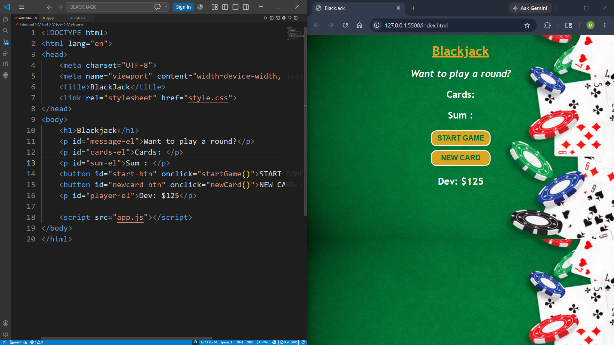
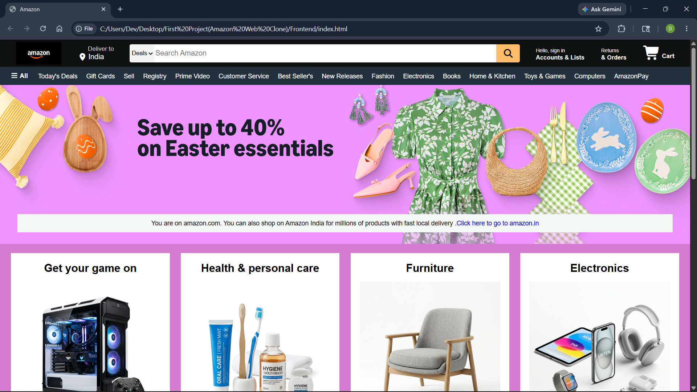
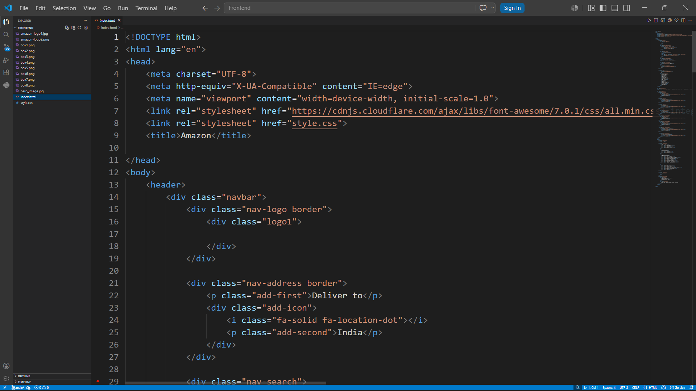
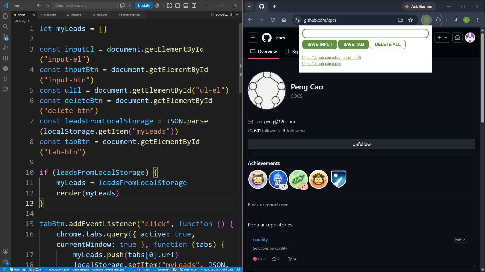
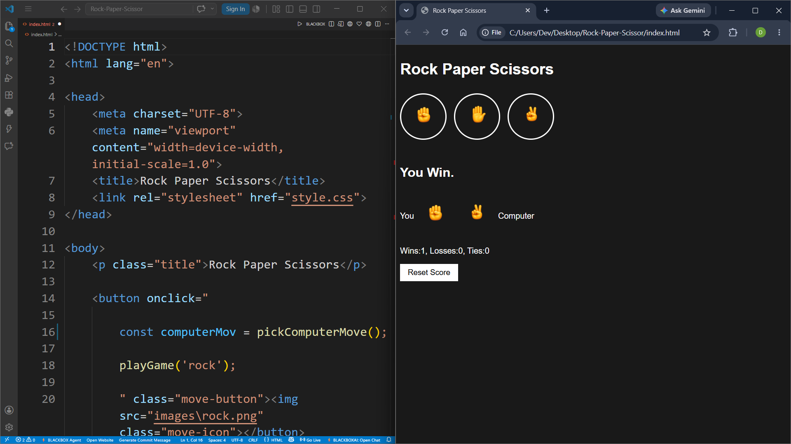

# Web Development Mini Projects - TOTAL(5)


A collection of mini web development projects built while learning HTML, CSS and JavaScript.

---

#  Total Projects : 5

---

## PROJECT - 1 : Subway Passenger Counter

| Project No. | Project Name | Technologies |
|---|---|---|
|    1 | Subway Passenger Counter | HTML, CSS, JavaScript |


###  Description

A simple subway passenger counter application that allows users to:

- Increase passenger count
- Save previous entries
- Practice DOM manipulation using JavaScript

## Features

- Increment passenger count
- Save count entries
- Display saved entries
- Reset count after saving
- Real-time UI updates
- Simple and responsive design
- Built with HTML, CSS, and JavaScript


###  Algorithm

1. Create webpage structure using HTML
2. Style the webpage using CSS
3. Use JavaScript to:
   - Increment passenger count
   - Save entries
   - Display previous counts
4. Dynamically update webpage using DOM manipulation


### Project Preview


---

## PROJECT - 2 : Black Jack

| Project No. | Project Name | Technologies |
|---|---|---|
| 2 | Black Jack | HTML, CSS, JavaScript |


### Description

A simple Blackjack card game built using HTML, CSS, and JavaScript.

Blackjack Game is a simple interactive web-based card game inspired by the classic casino game Blackjack. The project is built using HTML, CSS, and JavaScript and allows users to start a game, draw new cards, and try to reach a card sum of 21 without exceeding it.

This project demonstrates fundamental JavaScript concepts such as DOM manipulation, arrays, functions, conditional statements, and event handling while creating an engaging and responsive user interface.

### Features

- Start Game button
- Draw New Card
- Blackjack win detection at sum 21
- Dynamic card display
- Interactive UI

### Algorithm

1. Generate two random cards.
2. Calculate and display their sum.
3. If the sum is less than 21, allow the player to draw a new card.
4. If the sum equals 21, display "Blackjack!".
5. If the sum exceeds 21, end the game and display a losing message.
6. Repeat until the player wins or loses.

### Project Preview



---

## PROJECT - 3 : Amazon Clone

| Project No. | Project Name | Technologies |
|---|---|---|
| 3 | Amazon Clone | HTML, CSS |

### Description

A simple Amazon homepage clone built using *HTML* and *CSS*.  
This project was created to practice front-end web development concepts such as layouts, flexbox, positioning, hover effects, and responsive design.

##  Features

- Amazon-inspired homepage UI
- Responsive navigation bar
- Search bar design
- Product sections and cards
- Hero banner section
- Footer similar to Amazon
- Hover effects and styling
- Clean and beginner-friendly code


## Project Preview



## Code Preview




---

## PROJECT - 4 : Link Tracker Extension

| Project No. |Project Name| Technologies |
|---|---|---|
| 4 | Link Tracker Extension | HTML, CSS , JavaScript |

### Description

A simple Chrome Extension built with HTML, CSS, and JavaScript to save and manage useful links (leads).

---

## Installation

1. Clone this repository:

```bash
git clone (https://github.com/deviprasad716/Web-Development-Projects/tree/main/project-4_Link-Tracker-Extension)
```

2. Open Chrome and navigate to:

```
chrome://extensions/
```

3. Enable **Developer Mode**.

4. Click **Load unpacked**.

5. Select the project folder.

6. The extension will appear in your Chrome toolbar.

---

## Features / How to Use:

### Save a URL Manually

1. Enter a URL in the input field.
2. Click **SAVE INPUT**.
3. The URL will be stored and displayed in the list.

### Save the Current Tab

1. Open any webpage.
2. Click the extension icon.
3. Click **SAVE TAB**.
4. The current tab's URL will be saved automatically.

### Delete All Leads

--> Double-click the **DELETE ALL** button to remove all saved leads.

---

## Project Preview



---

## PROJECT - 5 : Rock Paper Scissor

| Project No. |Project Name| Technologies |
|---|---|---|
| 5th | Rock Paper Scissor | HTML5, CSS3, JavaScript(ES6), Browser Local Storage API |

### Features

- Play Rock, Paper, Scissors against the computer.
- Computer generates moves randomly.
- Scoreboard tracks:
   Wins
   Losses
   Ties
- Scores are saved using Local Storage even after refreshing the page.
- Reset button to clear all saved scores.
- Modern dark-themed user interface.
- Custom emoji-style hand icons for Rock, Paper, and Scissors

### Algorithm

**Step 1: Player selects a move**
The player clicks one of the three buttons:
Rock
Paper
Scissors

Step 2: Computer selects a move
The computer generates a random number using:
Math.random()
The random value determines the computer's move:
Range	Computer Move
0 - 1/3	     Rock
1/3 - 2/3	  Paper
2/3 - 1	     Scissors

Step 3: Compare moves
The program compares the player's move with the computer's move and determines:
Win
Lose
Tie

Step 4: Update score
Depending on the result:
Wins increase by 1
Losses increase by 1
Ties increase by 1
Step 5: Save score
The updated score is stored in browser local storage:
localStorage.setItem()

Step 6: Display result
The game updates:
Match result

## Project Preview


Selected moves
Updated score


