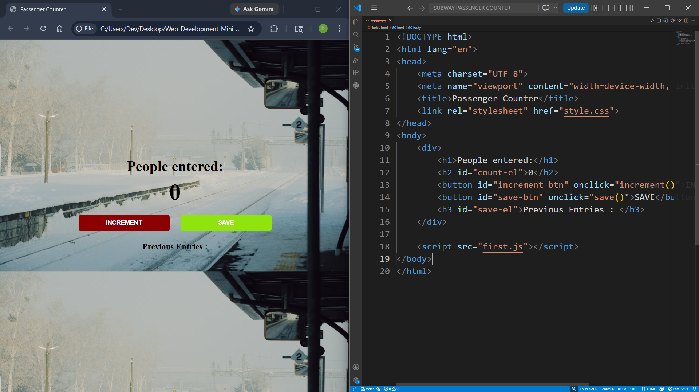

# Web Development Mini Projects

A collection of mini web development projects built while learning HTML, CSS and JavaScript.

---

#  Total Projects:1

| Project 1 | Subway-Passenger-Counter | Technologies |
|---|---|---|
| 1 | Subway Passenger Counter | HTML, CSS, JavaScript |

---

#  Projects

## PROJECT - 1 : Subway Passenger Counter

###  Description

A simple subway passenger counter application that allows users to:

- Increase passenger count
- Save previous entries
- Practice DOM manipulation using JavaScript

---

###  Technologies Used

- HTML5
- CSS3
- JavaScript

---

###  Algorithm

1. Create webpage structure using HTML
2. Style the webpage using CSS
3. Use JavaScript to:
   - Increment passenger count
   - Save entries
   - Display previous counts
4. Dynamically update webpage using DOM manipulation

---

### Project Preview

---

# Author

Deviprasad K M

