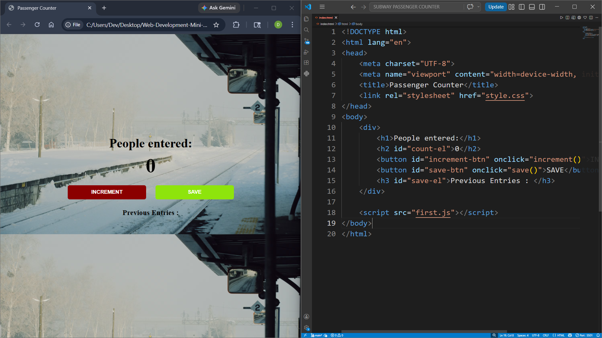

## PROJECT - 1 : Subway Passenger Counter

| Project No. | Project Name | Technologies |
|---|---|---|
| 1st | Subway Passenger Counter | HTML, CSS, JavaScript |

###  Description

A simple subway passenger counter application that allows users to:

- Increase passenger count
- Save previous entries
- Practice DOM manipulation using JavaScript

## Features

- Increment passenger count
- Save count entries
- Display saved entries
- Reset count after saving
- Real-time UI updates
- Simple and responsive design
- Built with HTML, CSS, and JavaScript

###  Algorithm

1. Create webpage structure using HTML
2. Style the webpage using CSS
3. Use JavaScript to:
   - Increment passenger count
   - Save entries
   - Display previous counts
4. Dynamically update webpage using DOM manipulation

### Project Preview

---