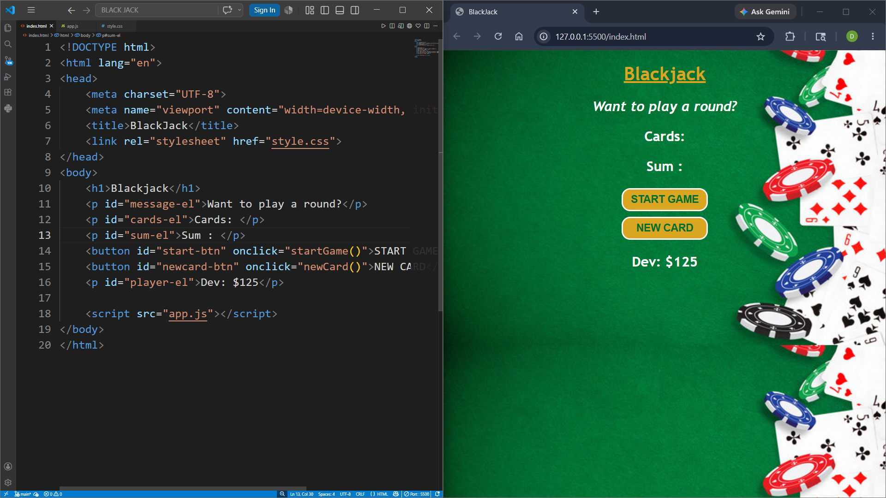

## PROJECT - 2 : Black Jack

| Project No. | Project Name | Technologies |
|---|---|---|
| 2nd | Black Jack | HTML, CSS, JavaScript |

### Description

A simple Blackjack card game built using HTML, CSS, and JavaScript.

Blackjack Game is a simple interactive web-based card game inspired by the classic casino game Blackjack. The project is built using HTML, CSS, and JavaScript and allows users to start a game, draw new cards, and try to reach a card sum of 21 without exceeding it.

This project demonstrates fundamental JavaScript concepts such as DOM manipulation, arrays, functions, conditional statements, and event handling while creating an engaging and responsive user interface.

### Features

- Start Game button
- Draw New Card
- Blackjack win detection at sum 21
- Dynamic card display
- Interactive UI

### Algorithm

1. Generate two random cards.
2. Calculate and display their sum.
3. If the sum is less than 21, allow the player to draw a new card.
4. If the sum equals 21, display "Blackjack!".
5. If the sum exceeds 21, end the game and display a losing message.
6. Repeat until the player wins or loses.

### Project Preview

---