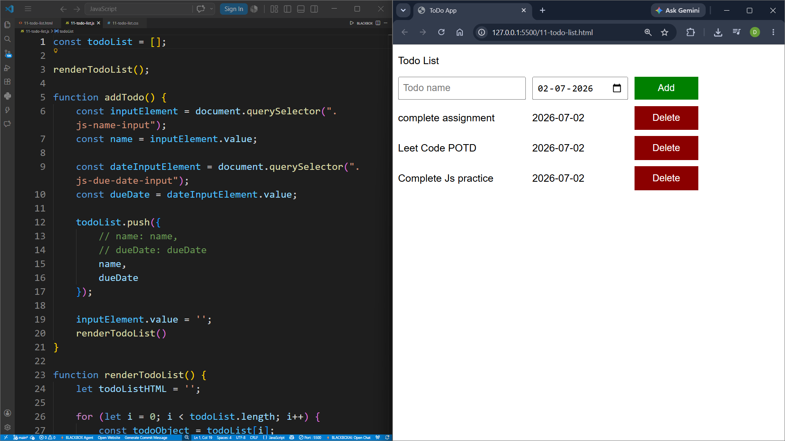

## PROJECT - 6 : Todo List

| Project No. |Project Name| Technologies |
|---|---|---|
| 6th | Todo List | HTML, CSS , JavaScript |

### Description

A simple and interactive **To-Do List Web Application** built using **HTML, CSS, and JavaScript**. This project allows users to add tasks with due dates, display them dynamically, and remove tasks when they are completed or no longer needed.

---

## Features

- Add new tasks
- Assign a due date to each task
- Display tasks dynamically
- Delete tasks instantly
- Real-time updates without page refresh
- Simple and user-friendly interface

## What I Learned

Through this project, I learned:

- Creating webpage layouts using HTML.
- Styling web pages with CSS.
- Selecting HTML elements using `document.querySelector()`.
- Handling button click events.
- Working with arrays of objects.
- Using object destructuring.
- Using `push()` to add items to an array.
- Using `splice()` to delete array elements.
- Writing reusable JavaScript functions.
- Dynamically updating the webpage using `innerHTML`.
- Using template literals to generate HTML.
- Rendering data without reloading the webpage.
- Understanding the basics of DOM Manipulation.

## Project Preview

