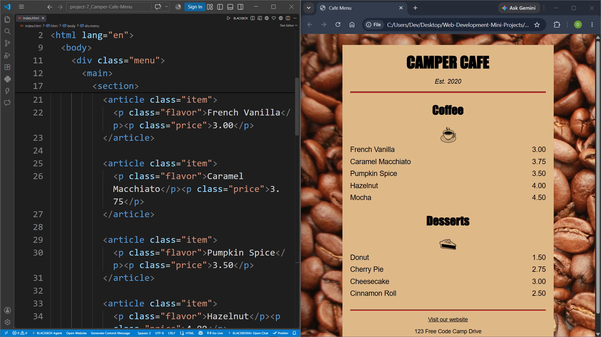

## PROJECT - 7 : Cafe Menu

| Project No. | Project Name | Technologies |
|---|---|---|
| 7th | Cafe Menu | HTML5, CSS3 |

### Description

A responsive cafe menu webpage built using HTML5 and CSS3. The project displays coffee and dessert items with their prices in a clean, structured layout. It demonstrates the use of semantic HTML elements, CSS styling, background images, typography, alignment, spacing, and interactive link states to create a simple and visually appealing cafe menu.

---

### Features

- Displays a cafe menu using a clean and structured layout.
- Displays the cafe name and establishment year.
- Separate sections for:
  - Coffee
  - Desserts
- Displays individual menu items with their prices.
- Uses images for the Coffee and Desserts sections.
- Uses a coffee-beans background image.
- Uses semantic HTML elements such as:
  - `<main>`
  - `<section>`
  - `<article>`
  - `<footer>`
  - `<address>`
- Uses CSS to create a centered cafe menu card.
- Uses different font styles for headings and menu items.
- Aligns menu item names to the left and prices to the right.
- Includes a website link in the footer.
- Includes cafe address information.
- Uses CSS pseudo-classes for link interactions.
- Uses an external CSS file for styling.
- Uses responsive viewport configuration for different screen sizes.

## Project Preview

